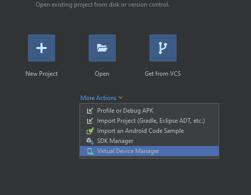

# Criando aplicativo 

> npm install -g npm
> npx create-expo-app@latest CriandoApp -t  

# Android Studio

- Opção para selecionar

- Create Device canto superior esquerdo 
- Pixel 7 com logo do play store 
- API 35 

# Vscode
- npx expo start 
- a: inicar android 

- Aprender sobre useState
